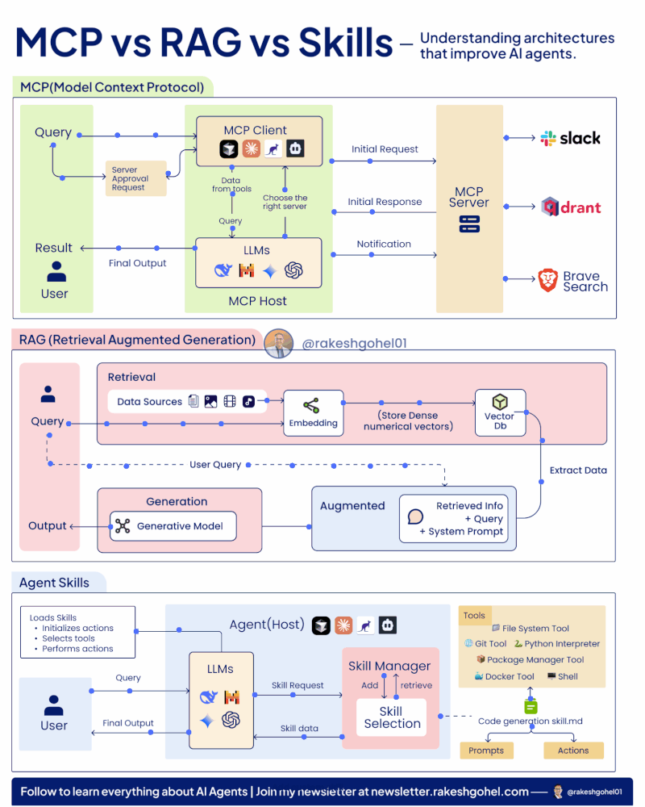

* B|
####+BEGIN: bxPanel:common/title-plus
#+title: AI/McpRagAndSkillsDiagrams
#+roam_tags: leaf
#+roam_key: bisos-core/AI/McpRagAndSkillsDiagrams
[[roam:bisos-core/AI]]
####+END
####+BEGIN: blee:bxPanel:topPanelControls
*  [[elisp:(org-cycle)][|#Control|]] :: [[elisp:(blee:bnsm:menu-back)][Back]] [[elisp:(toggle-read-only)][read/wr]] | [[elisp:(show-all)][Show-All]]  [[elisp:(org-shifttab)][Overview]]  [[elisp:(progn (org-shifttab) (org-content))][Content]] | [[elisp:(delete-other-windows)][(1)]] | [[elisp:(progn (save-buffer) (kill-buffer))][S&Q]] [[elisp:(save-buffer)][Save]] [[elisp:(kill-buffer)][Quit]] [[elisp:(bury-buffer)][Bury]] [[elisp:(magit)][Magit]] [[elisp:(call-interactively 'b:rg:panels/all)][rg:panels/all]]  [[elisp:(org-cycle)][| ]]
**  RipGrep:: [[elisp:(rg-menu)][rg-menu]] ||
**  [[elisp:(bap:magit:bisos:current-bpo-repos/visit)][BPO-Repos-Magit]] ||
**  [[elisp:(blee:buf:re-major-mode)][Re-Major-Mode]] ||  [[elisp:(org-dblock-update-buffer-bx)][Update Buf Dblocks]] || [[elisp:(org-dblock-bx-blank-buffer)][Blank Buf Dblocks]] || [[elisp:(bx:panel:variablesShow)][bx:panel:variablesShow]]
**  [[elisp:(blee:menu-sel:comeega:maintenance:popupMenu)][||Maintenance]]
**  This File :: *= /bisos/panels/bisos-core/AI/McpRagAndSkillsDiagrams/fullUsagePanel-en.org =*
* /file-truename:/  /bisos/git/auth/bxRepos/blee-binders/bisos-core/AI/McpRagAndSkillsDiagrams/fullUsagePanel-en.org
*  [[elisp:(org-cycle)][|#Select|]]  :: (Results: [[elisp:(blee:bnsm:results-here)][Here]] | [[elisp:(blee:bnsm:results-split-below)][Below]] | [[elisp:(blee:bnsm:results-split-right)][Right]] | [[elisp:(blee:bnsm:results-other)][Other]] | [[elisp:(blee:bnsm:results-popup)][Popup]]) (Select:  [[elisp:(lsip-local-run-command "lpCurrentsAdmin.sh -i currentsGetThenShow")][Show Currents]]  [[elisp:(lsip-local-run-command "lpCurrentsAdmin.sh")][lpCurrentsAdmin.sh]] ) [[elisp:(org-cycle)][| ]]
**  #See:  (Window: [[elisp:(blee:bnsm:results-window-show)][?]] | [[elisp:(blee:bnsm:results-window-set 0)][0]] | [[elisp:(blee:bnsm:results-window-set 1)][1]] | [[elisp:(blee:bnsm:results-window-set 2)][2]] | [[elisp:(blee:bnsm:results-window-set 3)][3]] ) || [[elisp:(lsip-local-run-command-here "echo pushd dest")][echo pushd dir]] || [[elisp:(lsip-local-run-command-here "lsf")][lsf]] || [[elisp:(lsip-local-run-command-here "pwd")][pwd]] |
**  [[elisp:(org-cycle)][|#Destinations|]] :: [[Evolution]] | [[Maintainers]]  [[elisp:(org-cycle)][| ]]
**  #See:  [[elisp:(bx:bnsm:top:panel-blee)][Blee]] | [[elisp:(bx:bnsm:top:panel-listOfDocs)][All Docs]]  E|
####+END
####+BEGIN: blee:bxPanel:title :panelType "=bxPanel=" :title "auto"
* [[elisp:(show-all)][(>]] ━━━━━━━━━━━━━━━━━━━━━━━━━━━━━━━━━━━━━━━━━━━━━━━━━━━━━━━━━━━━━━━━━━━━━━━━━━━━━━━━━━━━━━━━━━━━━━━━━
*   [[img-link:file:/bisos/blee/env/images/fpfByStarElipseTop-50.png][http://www.freeprotocols.org]]_ _   bisos--~Leaf:: bisos-core/AI -- McpRagAndSkillsDiagrams~   [[img-link:file:/bisos/blee/env/images/fpfByStarElipseBottom-50.png][http://www.by-star.net]]
* ━━━━━━━━━━━━━━━━━━━━━━━━━━━━━━━━━━━━━━━━━━━━━━━━━━━━━━━━━━━━━━━━━━━━━━━━━━━━━━━━━━━━━━━━━━━━━  [[elisp:(org-shifttab)][<)]] E|
####+END:
####+BEGIN: blee:bxPanel:terseTreeNavigator :panelsList "bxPanel"
* [[elisp:(show-all)][(>]] [[elisp:(describe-function 'org-dblock-write:blee:bxPanel:terseTreeNavigator)][dbf]]
* +
*   *Siblings*   :: [[elisp:(blee:bnsm:panel-goto "/bisos/panels/bisos-core/AI/Blee-AI/_nodeBase_")][ = /<Blee-AI>/ = ]] *|* [[elisp:(blee:bnsm:panel-goto "/bisos/panels/bisos-core/AI/McpRagAndSkillsDiagrams")][McpRagAndSkillsDiagrams]] *|* [[elisp:(blee:bnsm:panel-goto "/bisos/panels/bisos-core/AI/aider/_nodeBase_")][ =aider= ]] *|* [[elisp:(blee:bnsm:panel-goto "/bisos/panels/bisos-core/AI/claude/_nodeBase_")][ =claude= ]] *|* [[elisp:(blee:bnsm:panel-goto "/bisos/panels/bisos-core/AI/deepSeek/_nodeBase_")][ =deepSeek= ]] *|*
*   *Siblings*   :: [[elisp:(blee:bnsm:panel-goto "/bisos/panels/bisos-core/AI/ollama/_nodeBase_")][ =ollama= ]] *|*
*   /Ancestors/  :: [[elisp:(blee:bnsm:panel-goto "//bisos/panels/bisos-core/AI/McpRagAndSkillsDiagrams")][McpRagAndSkillsDiagrams]] *|* [[elisp:(blee:bnsm:panel-goto "//bisos/panels/bisos-core/AI/_nodeBase_")][ =AI= ]] *|* [[elisp:(blee:bnsm:panel-goto "//bisos/panels/bisos-core/_nodeBase_")][ =bisos-core= ]] *|* [[elisp:(blee:bnsm:panel-goto "//bisos/panels/_nodeBase_")][ = /<panels>/ = ]] *|* [[elisp:(dired "//bisos")][ ~bisos~ ]] *|*
*                                   _━━━━━━━━━━━━━━━━━━━━━━━━━━━━━━_                          [[elisp:(org-shifttab)][<)]] E|
####+END
####+BEGIN: blee:bxPanel:foldingSection :outLevel 1 :title "Overview" :anchor "Panel"
* [[elisp:(show-all)][(>]]  _[[elisp:(blee:menu-sel:outline:popupMenu)][±]]_  _[[elisp:(blee:menu-sel:navigation:popupMenu)][Ξ]]_       [[elisp:(outline-show-subtree+toggle)][| *Overview:* |]] <<Panel>>   [[elisp:(org-shifttab)][<)]] E|
####+END
** +
** Overview Comes Here.
** B|

* Diagram 

* MCP vs RAG vs Skills 🔁

Understanding architectures that improve AI agents
__________

Here are the 3 Core Pillars of Every AI Agent's Context

Here's why MCP, RAG and Skills are now unavoidable...

Before we dive in, here's why all 3 exist in the first place:

Every AI Agent struggles with 3 core problems:

- Connecting to external tools requires writing custom API code every time
- Answering accurately from knowledge it was never trained on
- Repeating the same instructions in prompts; wasting tokens on every single call

MCP, RAG, and Skills were each built to solve exactly one of these problems.

📌 1\ MCP \(Model Context Protocol\)

MCP eliminates the need to write custom API integration code every time your agent needs to connect to an external tool.

How it works:

- User sends a query → MCP Client selects the right server
- LLM processes the request and routes it to the MCP Server
- Server \(Slack, Qdrant, Brave Search\) responds with the relevant data
- Final output is returned back to the user

Key insight: Without MCP, every new tool connection means new custom code. With MCP, your agent plugs into any server through one standardized protocol.

Use when: You want your agent to access external tools and services without rebuilding integrations from scratch each time.

📌 2\ RAG \(Retrieval Augmented Generation\)

RAG gives your agent memory-enabled retrieval, so it reasons over knowledge it was never trained on, instead of hallucinating answers.

How it works:

- Data sources are chunked → converted into embeddings
- Stored as dense vectors inside a Vector DB
- User query triggers a search → most relevant chunks are retrieved
- Retrieved info + query + system prompt → fed into the LLM → Output

Key insight: Without RAG, agents confidently make things up. With RAG, they retrieve first, then reason.

Use when: You want your agent to reason over large, dynamic knowledge bases with accuracy and context.

📌 3\ Agent Skills

Skills stop your agent from wasting tokens by repeating the same instructions in every single prompt.

How it works:

- User query → LLM sends a Skill Request to the Skill Manager
- Skill Manager retrieves the right skill using stored prompts and actions
- Tools like Git, Docker, Python Interpreter, and Shell are triggered
- Skill data flows back to the LLM → Final Output is delivered

Key insight: Without Skills, you bloat every prompt with repeated instructions. With Skills, your agent loads only what it needs, exactly when it needs it.

Use when: You want reusable, token-efficient actions your agent can execute without being re-instructed every time.

Source: Andrew Joubert
####+BEGIN: blee:bxPanel:separator :outLevel 1
* /[[elisp:(beginning-of-buffer)][|^]] [[elisp:(blee:menu-sel:navigation:popupMenu)][==]] [[elisp:(delete-other-windows)][|1]]/
####+END
####+BEGIN: blee:bxPanel:evolution
* [[elisp:(show-all)][(>]] [[elisp:(describe-function 'org-dblock-write:blee:bxPanel:evolution)][dbf]]
*                                   _━━━━━━━━━━━━━━━━━━━━━━━━━━━━━━_
* [[elisp:(show-all)][|n]]  _[[elisp:(blee:menu-sel:outline:popupMenu)][±]]_  _[[elisp:(blee:menu-sel:navigation:popupMenu)][Ξ]]_     [[elisp:(org-cycle)][| *Maintenance:* | ]]  [[elisp:(blee:menu-sel:agenda:popupMenu)][||Agenda]]  <<Evolution>>  [[elisp:(org-shifttab)][<)]] E|
####+END
####+BEGIN: blee:bxPanel:foldingSection :outLevel 2 :title "Notes, Ideas, Tasks, Agenda" :anchor "Tasks"
** [[elisp:(show-all)][(>]]  _[[elisp:(blee:menu-sel:outline:popupMenu)][±]]_  _[[elisp:(blee:menu-sel:navigation:popupMenu)][Ξ]]_       [[elisp:(outline-show-subtree+toggle)][| /Notes, Ideas, Tasks, Agenda:/ |]] <<Tasks>>   [[elisp:(org-shifttab)][<)]] E|
####+END
*** TODO Some Idea
####+BEGIN: blee:bxPanel:evolutionMaintainers
** [[elisp:(show-all)][(>]] [[elisp:(describe-function 'org-dblock-write:blee:bxPanel:evolutionMaintainers)][dbf]]
** [[elisp:(show-all)][|n]]  _[[elisp:(blee:menu-sel:outline:popupMenu)][±]]_  _[[elisp:(blee:menu-sel:navigation:popupMenu)][Ξ]]_       [[elisp:(org-cycle)][| /Bug Reports, Development Team:/ | ]]  <<Maintainers>>
***  Problem Report                       ::   [[elisp:(find-file "")][Send debbug Email]]
***  Maintainers                          ::   [[bbdb:Mohsen.*Banan]]  :: http://mohsen.1.banan.byname.net  E|
####+END
* B|
####+BEGIN: blee:bxPanel:footerPanelControls
* [[elisp:(show-all)][(>]] ━━━━━━━━━━━━━━━━━━━━━━━━━━━━━━━━━━━━━━━━━━━━━━━━━━━━━━━━━━━━━━━━━━━━━━━━━━━━━━━━━━━━━━━━━━━━━━━━━
* /Footer Controls/ ::  [[elisp:(blee:bnsm:menu-back)][Back]]  [[elisp:(toggle-read-only)][toggle-read-only]]  [[elisp:(show-all)][Show-All]]  [[elisp:(org-shifttab)][Cycle Glob Vis]]  [[elisp:(delete-other-windows)][1 Win]]  [[elisp:(save-buffer)][Save]]   [[elisp:(kill-buffer)][Quit]]  [[elisp:(org-shifttab)][<)]] E|
####+END
####+BEGIN: blee:bxPanel:footerOrgParams
* [[elisp:(show-all)][|n]]  _[[elisp:(blee:menu-sel:outline:popupMenu)][±]]_  _[[elisp:(blee:menu-sel:navigation:popupMenu)][Ξ]]_     [[elisp:(org-cycle)][| *= Org-Mode Local Params: =* | ]]
#+STARTUP: overview
#+STARTUP: lognotestate
#+STARTUP: inlineimages
#+SEQ_TODO: TODO WAITING DELEGATED | DONE DEFERRED CANCELLED
#+TAGS: @desk(d) @home(h) @work(w) @withInternet(i) @road(r) call(c) errand(e)
#+CATEGORY: L:McpRagAndSkillsDiagrams

####+END
####+BEGIN: blee:bxPanel:footerEmacsParams :primMode "org-mode"
* [[elisp:(show-all)][|n]]  _[[elisp:(blee:menu-sel:outline:popupMenu)][±]]_  _[[elisp:(blee:menu-sel:navigation:popupMenu)][Ξ]]_     [[elisp:(org-cycle)][| *= Emacs Local Params: =* | ]]
# Local Variables:
# eval: (setq-local toc-org-max-depth 4)
# eval: (setq-local ~selectedSubject "noSubject")
# eval: (setq-local ~primaryMajorMode 'org-mode)
# eval: (setq-local ~blee:panelUpdater nil)
# eval: (setq-local ~blee:dblockEnabler nil)
# eval: (setq-local ~blee:dblockController "interactive")
# eval: (img-link-overlays)
# eval: (set-fill-column 115)
# eval: (blee:fill-column-indicator/enable)
# eval: (bx:load-file:ifOneExists "./panelActions.el")
# End:

####+END
